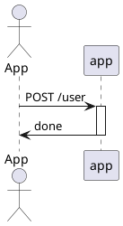

### ONE

- foo
- bar

---

### TWO

```js
let a = "bar";
```

---

### THREE



---

<!-- .slide: data-visibility="hidden" -->

### FOUR

hidden slide

---

### FIVE

<!-- .slide: data-background="#ff0000" -->

with background
